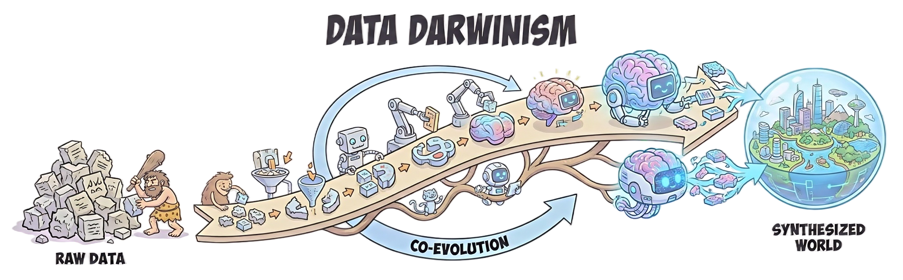
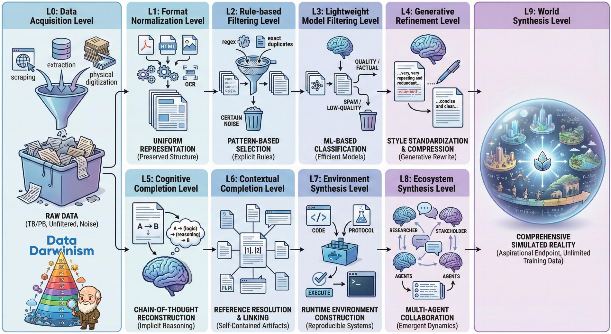

# Data Darwinism -- Part1: Unlocking the Value of Scientific Data for Pre-training

<div align="center">

[](report.pdf)
[](https://huggingface.co/datasets/GAIR/Darwin-Science)
[](https://huggingface.co/GAIR/daVinci-origin-3B)
[](https://huggingface.co/GAIR/daVinci-origin-7B)
[](https://huggingface.co/datasets/GAIR/Darwin-Science-Eval)

</div>

## 📖 Overview

<div align="center">
  
</div>


**Data Darwinism** is a conceptual framework and practical methodology for the co-evolution of data and foundation models. We address a critical bottleneck in modern AI: the **Learnability Gap** in conceptually dense domains.

While scientific literature is information-rich, raw scientific data provides negligible gains in pre-training due to implicit reasoning, noise, and high compression. In this work, we introduce a ten-level taxonomy (**L0–L9**) to organize data transformations. We validate this by constructing **`Darwin-Science`**, a 496B-token high-quality corpus processed via **Generative Refinement (L4)** and **Cognitive Completion (L5)**, demonstrating that systematic data processing is essential to unlock the value of scientific text.

To ensure rigorous validation, we also release **daVinci-Science**, a family of foundation models trained from scratch, serving as clean baselines for measuring data quality impact.

---

## 🧬 The Data Darwinism Hierarchy

<div align="center">
  
</div>

Data Darwinism conceptualizes data processing not as a static pipeline, but as an evolutionary ladder. As data ascends from L0 to L9, volume decreases while information density and learnability increase.

| Level | Stage | Description | Key Operation |
| :--- | :--- | :--- | :--- |
| **L0–L3** | **Selection & Preservation** | Filtering raw data. | Heuristic filtering, deduplication. |
| **L4** | **Generative Refinement** | Removing noise and repairing fragmentation. | LLM-based noise removal, formula repair. |
| **L5** | **Cognitive Completion** | Expanding implicit reasoning. | Explicating terminology, bridging logical gaps. |
| **L6–L9** | **Synthetic Evolution** | (Future Work) Model-driven synthesis. | Creating new environments/worlds. |

---

## 📦 Released Artifacts

### 1. 🗂️ `Darwin-Science` Corpus & Processing Pipeline
High-quality scientific corpus with complete data processing methodology.
- **Size:** 496B tokens of processed scientific data.
- **Content:** Academic books, research papers (STEM, Medicine, Engineering).
- **Processing:** Full open-source pipeline implementing Hierarchy levels L0 through L5 (Selection, Refinement, Cognitive Completion).
- **🔗 Links:**
  - 🤗 [Dataset on Hugging Face](https://huggingface.co/datasets/GAIR/Darwin-Science)


### 2. 🤖 `daVinci-Science` Models
Clean-slate pre-trained foundation models for rigorous data quality validation.
- **daVinci-Science-3B**
- **daVinci-Science-7B**
- **Purpose:** Models trained from scratch to provide contamination-free baselines for measuring the impact of scientific data processing.
- **🔗 Links:**
  - 🤗 [daVinci-Science-3B](https://huggingface.co/GAIR/daVinci-origin-3B)
  - 🤗 [daVinci-Science-7B](https://huggingface.co/GAIR/daVinci-origin-7B)

### 3. 📋 `Darwin-Science-Eval` Benchmark
Comprehensive scientific evaluation suite for domain-aligned assessment.
- **Size:** 150K expert-level evaluation samples.
- **Source:** Held-out scientific literature with verified quality.
- **🔗 Links:**
  - 🤗 [Benchmark Dataset](https://huggingface.co/datasets/GAIR/Darwin-Science-Eval)

---

## 📊 Results & Key Findings

We conducted 600B tokens of Continued Pre-training (CPT) on top of daVinci-Science using `Darwin-Science`.

### Performance Gains
| Metric | 3B Model Gain | 7B Model Gain |
| :--- | :--- | :--- |
| **General Benchmarks (20+)** | **+2.12** | **+2.95** |
| **Darwin-Science-Eval** | **+5.60** | **+8.40** |

### Evidence-Based Guidelines
Through our controlled experiments, we established the following laws for scientific pre-training:
1.  **Hierarchy is Essential:** Moving from L0 to L5 yields a total gain of **+1.36**, proving that raw data alone is insufficient.
2.  **No Saturation:** Performance gains accelerate through 600B tokens with no sign of diminishing returns.
3.  **Scale Multiplier:** Larger models (7B) extract disproportionately more value from scientific data than smaller models (3B).
4.  **Teacher Quality:** The quality of the L5 teacher matters (e.g., Qwen3-235B yields +0.52 over GPT-OSS-120B).
5.  **Golden Ratio:** A **50% scientific content ratio** optimizes the balance between domain specialization and general capabilities.

---

## 📚 Citation

If you use Data Darwinism, the dataset, or the baselines in your research, please cite:

```bibtex


```
